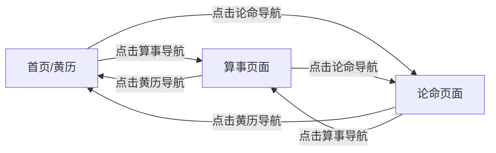
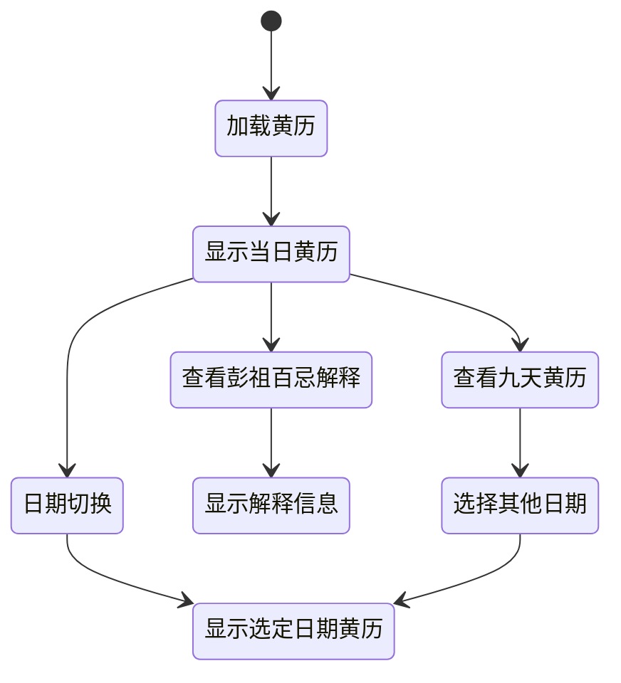
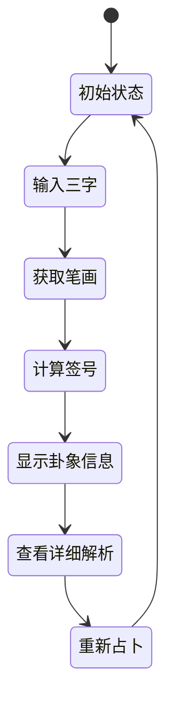
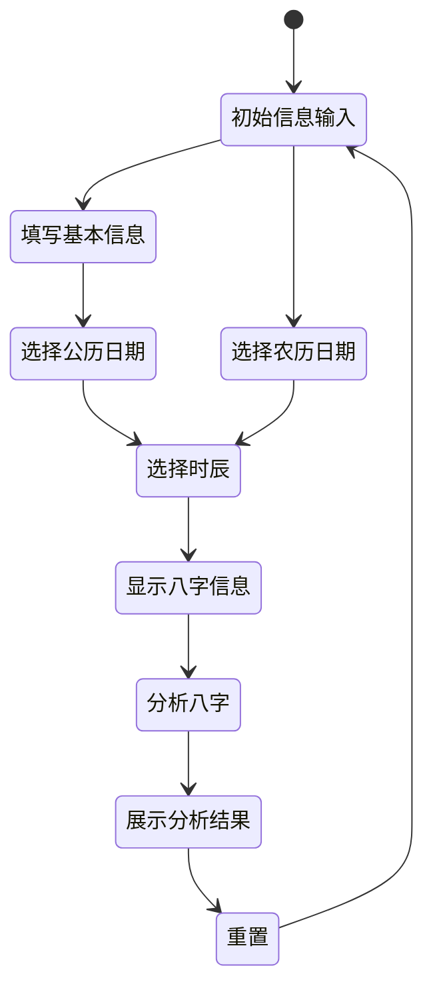
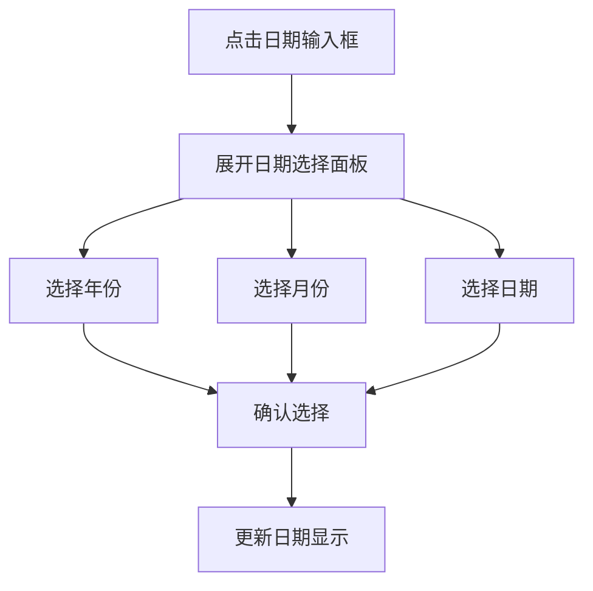
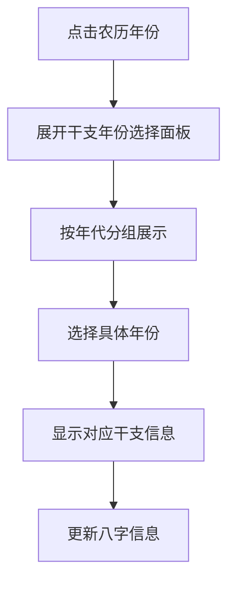
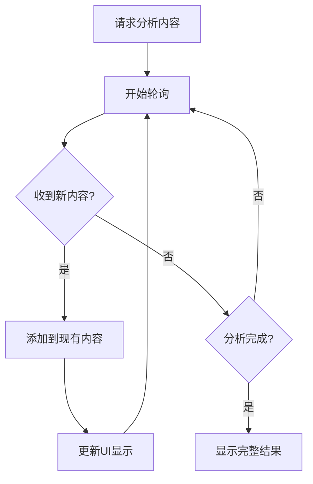

# 诸葛神算微信小程序 - 页面交互流程图

本文档描述了诸葛神算微信小程序的主要页面流程、交互路径和关键功能节点，可作为前端开发的参考指南。

## 目录

1. [总体页面架构](#总体页面架构)
2. [黄历功能流程](#黄历功能流程)
3. [算事功能流程](#算事功能流程)
4. [论命功能流程](#论命功能流程)
5. [通用组件交互](#通用组件交互)

## 总体页面架构

```
首页（黄历）
  ├── 黄历功能
  ├── 算事功能
  └── 论命功能
```

### 页面层级结构

```
app
├── pages/
│   ├── index/                # 黄历主页
│   ├── suanshi/              # 算事页面
│   ├── lunming/              # 论命页面
│   ├── guaDetail/            # 卦象详情页
│   ├── analysisResult/       # 八字分析结果页
│   └── common/               # 通用组件
└── utils/                    # 工具函数
```

### 主导航流程



## 黄历功能流程

### 页面状态图



### 用户交互流程

1. **进入黄历页面**
   - 自动加载当日黄历信息
   - 显示农历日期、干支、宜忌、神煞等信息
   - 显示九天黄历概览

2. **日期选择交互**
   - 用户可点击"前一天"/"后一天"按钮切换日期
   - 用户可点击"今天"按钮返回当日
   - 用户可使用日期选择器选择特定日期
   - 用户可在九天黄历中点击任意日期查看详情

3. **查看彭祖百忌解释**
   - 用户点击/长按彭祖百忌文本
   - 显示弹窗或悬浮提示，展示对应解释
   - 用户点击空白区域关闭解释

4. **农历/公历切换**
   - 用户可使用公历日期选择器
   - 用户可使用农历日期选择器
   - 两种日期自动同步转换

## 算事功能流程

### 页面状态图



### 用户交互流程

1. **进入算事页面**
   - 显示占卜引导文字和输入框
   - 用户输入需要占卜的三个汉字
   - 用户点击"开始测算"按钮

2. **笔画计算流程**
   - 系统获取三个汉字的笔画数
   - 显示笔画数结果
   - 用户点击"查看签号"按钮

3. **签号计算与卦象展示**
   - 系统计算并显示签号
   - 用户点击"解卦"按钮
   - 显示卦象类型和吉凶

4. **查看卦象详细解析**
   - 用户点击"查看解签"按钮
   - 系统展示详细解签
   - 用户点击相应标签查看不同方面解析（事业、财运等）

5. **重新占卜**
   - 用户点击"重新占卜"按钮
   - 系统清空已有输入和结果
   - 返回初始输入状态

## 论命功能流程

### 页面状态图



### 用户交互流程

1. **进入论命页面**
   - 显示引导文字和信息输入表单
   - 用户输入姓名
   - 用户选择性别

2. **选择出生日期**
   - 用户可选择使用公历或农历日期
   - 填写年、月、日信息
   - 两种日历系统自动同步转换

3. **选择出生时辰**
   - 用户从12时辰（子、丑、寅...）中选择
   - 系统显示对应时间范围
   - 用户可选择"未知"选项

4. **查看八字信息预览**
   - 系统实时显示八字信息、干支、生肖等
   - 用户确认信息无误

5. **开始八字分析**
   - 用户点击"开始分析"按钮
   - 显示加载动画
   - 系统流式展示分析结果

6. **查看完整分析结果**
   - 展示标题、内容的层级结构
   - 用户滚动查看不同部分
   - 用户可点击"重置"按钮重新开始

## 通用组件交互

### 日期选择器组件



### 农历年份选择器



### 流式内容展示



## 特殊交互说明

1. **彭祖百忌悬浮提示**：
   - 桌面端：鼠标悬浮显示解释
   - 移动端：点击显示解释，再次点击或点击其他区域关闭

2. **农历/公历日期联动**：
   - 任一日期变化时，自动更新另一日期
   - 显示对应的星期、节气、节日等信息

3. **年份干支显示**：
   - 选择年份时，实时显示对应干支
   - 年份输入自动联想匹配干支年

4. **时辰选择**：
   - 显示干支+时间范围，如"子时(23:00-01:00)"
   - 可选择"未知/不确定"选项

5. **加载状态处理**：
   - 数据加载时显示动画
   - 长文本生成时使用流式文本显示
   - 网络请求失败时提供友好提示和重试选项 